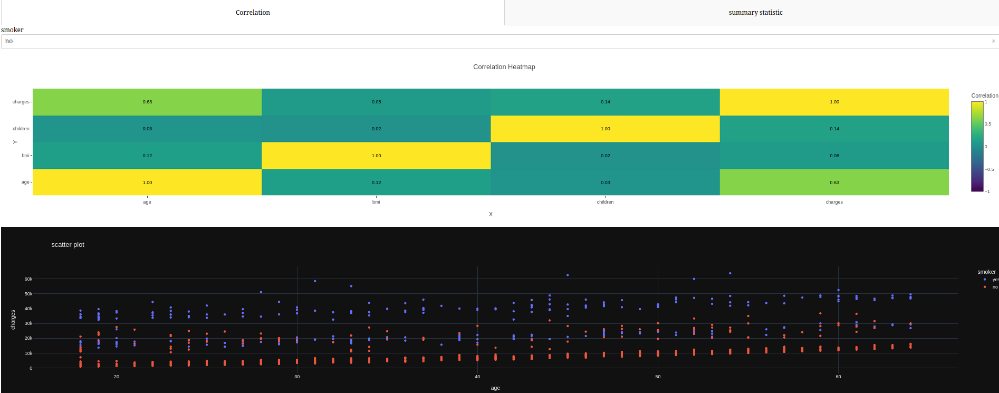

# AnalysisData
Step-by-step guide to learning and practicing Data Science
# Insurance Data Summary Statistics

This project aims to provide summary statistics of insurance data and visualize them using Pandas, Dash, and Plotly. Additionally, it includes PostgreSQL queries to calculate correlation and other statistical values.

## Features

- Calculate summary statistics of insurance data
- Visualize the data using interactive charts and graphs on a web interface
- Perform PostgreSQL queries to calculate correlation and other statistical values

## Technologies Used

- Python
- Pandas
- Dash
- Plotly
- Postgresql
- Jupyter

